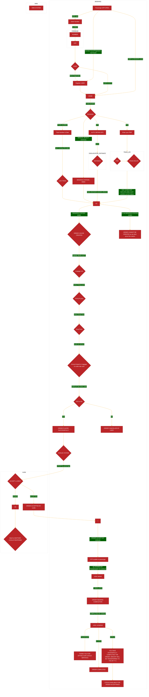

# complete_flow

```mermaid
%%{
  init: {
    'theme': 'base',
    'themeVariables': {
      'primaryColor': '#BB2528',
      'primaryTextColor': '#fff',
      'primaryBorderColor': '#7C0000',
      'lineColor': '#F8B229',
      'secondaryColor': '#006100',
      'tertiaryColor': '#fff'
    }
  }
}%%
flowchart TD
    subgraph BOOKING
    a1[Passenger APP OPEN]-->|NEW user| a2[Enter Number] 
    a2-->|NUMBER| FIREBASE  
    a3{USER}--->|NEW Registration|a4[Register USER] ---> B1[HOME]
    a3 --->|USER EXISTS|B1
    a1 --->|USER & SESSION exists|B1
    a1 --->|Number found,Registation not Found | a4  
 
    B1 ---> |Create Booking|C1{BOOKING} 
    C1 ---> |GPS|c2[AUTO OBTAIN GPS] --->|lat,lon|GEOLOCATOR_DISTANCE
    GEOLOCATOR_DISTANCE ---->|origin,destination,duration,distance| E1 
    C1 --->|PNR| c3[Enter your PNR] ---> TRAIN_API ----> |train number,train name,time,date,coach position,current status|E1
    C1 --->|TRAIN NUMBER| C4[Train Number & Date] ---->  |train running information |T3 ---> E1 
    C1 --->|MANUAL SELECT STATION| C5[BANARAS STATION -BSBS] ---> E1
    E1 ---->|BANARAS STATION -BSBS| E2{ORDER CAN BE CREATED}
    E1 ----> |IS not BANARAS STATION -BSBS| EN1[ORDER CANNOT BE CREATED as we dont serve this station]
    E2 -----> |luggage details & QTY| E3{LUgagge Info}
    E3 ----> |Select Pickup point| E4{PICKUP point}
    E4 -----> |Select Drop Point| E5{Drop Point}
    E5 -----> |Quote an amount| E6{Amount based on luggage & coolie rate card}
    E6 -----> |DISPLAY the Entire order| E7{YES or NO}
    E7 -----> |YES| E8[ORDER PLACED SUCCESSFULLY]
    E7 -----> |NO| E9[ORDER CANCELLED BY USER]
    E8 ----> H1
    I ---> |ORDER ACCEPT BY COOLIE| I1[OTP avaible to passenger]
    I1 ---> |otp SHARED BY PASSENGER TO COOLIE| J1[order started]
    J1 ----->|7 MINS LATER| J2[ORDER NEARING COMPLETION]
    J2 -----> |COMPLETED BY COOLIE| J3[order completed]
    J3  ------ |PASSENGER|J5[THANK YOU FOR OPTING OUR COOLIE SERVICES]
    J3 ------> |SYSTEM| J6[ORDER COMPLETED]
    J3 -----> |COOLIE|J4[YOU HAVE SUCESSFULLY COMPLETED THE ORDER, AMOUNT WILL BE TRANSFERRED TO YOU BY T+1 ] ----> J8[COOLIE AVAILABLE FOR ORDER ACCEPTANCE]
    end
    subgraph TRAIN_API
    T1{PNR}-->T2{TRAIN ROUTE}
    T3{LIVE TRAIN}
    end
    subgraph FIREBASE
    F1[NUMBER]-->F2[OTP] --->a3
    end
    subgraph GEOLOCATOR_DISTANCE
    D1{DISTANCE}
    end
    subgraph OMS 
    OM[OMS SYSTEM]
    end
    subgraph coolie
    H1{COOLIE SYSTEM } --->|ORDER by passenger| H2{ACCEPT or DENY}
    H2 ---->|ACCEPTED| H3[ORDER ACCEPTED BY coolie] ---> I 
    H2 ----> |DENIED| H4 ----> H5{Wait for ANOTHER COOLIE RESPONSE}

    end


```
